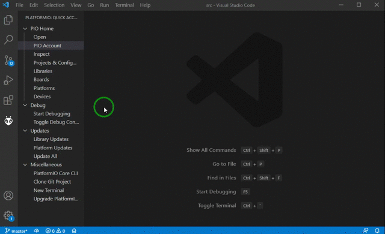
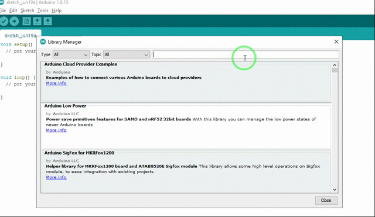

Official library to use OTAdrive services in ESP8266/ESP32 arduino platform

[](https://registry.platformio.org/libraries/otadrive/OTAdrive)

## Arduino library
OTAdrive Arduino library provides all features of our service with user friendly interface.
The library exists on both [Arduino repository](https://github.com/otadrive/OTAdriveESP) and [PlatformIO registry](https://platformio.org/lib/show/12450/OTAdrive).  

## Installation
### Install on PlatformIO
To install the library on PlatformIO project you find the project in PIO library manager and add it to your project. 



Or you can simply add following line in `lib_deps` section of the `platfomrio.io` file:

```ini
lib_deps =
   otadrive/OTAdrive
```
### Install on Arduino IDE
You could find OTAdrive library on library manager and add it to your project. 



## Methods
Bellow is the list of OTAdrive library.


|Method         |Description|
|:------------- |:-------------|
|[setInfo](#setInfo)|Sets general information about your firmware. You should call this method first.|
|[updateFirmware](#updateFirmware)|Updates firmware from the OTAdrive server, if a newer version is available.|
|[sendAlive](#sendAlive)| Sends a request to the server containing the last status of the device |
|[getConfigs](#getConfigs)|Gets device configuration as string|
|[onUpdateFirmwareProgress](#onUpdateFirmwareProgress)| Sets your callback method for update firmware progress |
|[syncResources](#syncResources)|Syncs `SPIFFS` files with the OTAdrive server|
|[setFileSystem](#setFileSystem)|Sets the fileSystem object. You have to call it before use `syncResources()`|
|[timeTick](#timeTick)|A helper for periodical syncing|


  
### setInfo
```cpp
void setInfo(String apiKey,String firmwareVersion)
```
You have to call `setInfo` once and before any usage of OTAdrive library.

```cpp
void setup()
{
  ...
  // Set ApiKey and firmware version of your device
  // Remember, You have to change the version field before
  //   upload the firmware.bin to the OTAdrive
  OTADRIVE.setInfo("c0af643b-4f90-4905-9807-db8be5164cde", "2.5.5");
}
```

### updateFirmware
```cpp
updateInfo updateFirmware(bool reboot = true)
```
This method calls update firmware API and updates your ESP8266/ESP32 firmware if a newer(different) version available on the OTAdrive server. You can show the update progress to users by using [onUpdateFirmwareProgress](#onUpdateFirmwareProgress) event.  
After successfull firmware update, the device should reset. If you want to do something before restart (for exampl save some value), you should pass `reboot` parameter as `false`, then you have to call `ESP.restart()` yourself.

```cpp
// The device will reboot here on success update
auto r = OTADRIVE.updateFirmware();
Serial.printf("Update result is: %s\n", r.toString().c_str());
```

### sendAlive
```cpp
bool sendAlive()
```
The method sends a request to the OTAdrive sever, includes the statuses of the device such as firmware version, battery voltage, RSSI, etc. Just call this method every time you want.
```cpp
OTADRIVE.sendAlive();
```

### getConfigs
```cpp
String getConfigs()
```
This method calls configuration API and gets the configuration of the device from the server. It returns a string containing JSON configurations.

```cpp
String c = OTADRIVE.getConfigs();
Serial.printf("configuration: %s\n", c.c_str());
```

### onUpdateFirmwareProgress
```cpp
void onUpdateFirmwareProgress(THandlerFunction_Progress fn)
```
If you want to show update progressbar to the device's user, You can use this method to get download percentage of the new firmware.  
The method has two parameters, `total` contains size of the new firmware and `progress` contains the number of downloaded bytes.  
Following code shows how to show a update progressbar.
```cpp
void onUpdateProgress(int progress, int totalt)
{
  static int last = 0;
  int progressPercent = (100 * progress) / totalt;
  Serial.print("*");
  if (last != progressPercent && progressPercent % 10 == 0)
  {
    // print every 10%
    Serial.printf("%d", progressPercent);
  }
  last = progressPercent;
}

void setup()
{
  ...
  OTADRIVE.onUpdateFirmwareProgress(onUpdateProgress);
}
```

### syncResources
```cpp
bool syncResources()
```
This method calls resource API and downloads new files from the server to local storage (SPIFFS or LittleFS). If you modify files on the server, this method detects changes and replaces the old file with the modified file. 

```cpp
// sync local files with OTAdrive server
OTADRIVE.syncResources();
```

### setFileSystem
```cpp
void setFileSystem(FS *fileObj)
```
If you have resources (HTML, JS, MP3, JPG, etc.) for the update, The library should download and save them to the device storage with a suitable file system. There are at least two different kinds of file systems developed for ESP MCUs, The SPIFFS, and The LittleFS. The library will choose The SPIFFS for ESP32 and The LittleFS for ESP8266 automatically. If you want to change the file system handler to something else, you should call this method.
```cpp
OTADRIVE.setFileSystem(/*pointer to your file system object*/)
```

### timeTick
```cpp
bool timeTick(uint16_t seconds)
```
This method helps you to manage intervals between each update/sync operation between your device and the OTAdrive.  
The following example shows how to check and update firmware every 5 minutes (300 seconds).
```cpp
void loop()
{
  ...
  if (OTADRIVE.timeTick(300))
  {
    auto r = OTADRIVE.updateFirmware();
    Serial.printf("Update result is: %s\n", r.toString().c_str());
  }
}
```

## Example
You can find a complete example [Here](https://github.com/otadrive/OTAdriveESP/tree/master/examples). The library is compatible with ESP32 and ESP8266 with no action, just include `otadrive_esp.h` and start to use our service like charm.

The following code shows all features of this library:
```cpp
// do it every 5 minutes (300 seconds)
if(OTADRIVE.timeTick(300))
{
    // retrive firmware info from OTAdrive server
    updateInfo inf = OTADRIVE.updateFirmwareInfo();
    // update firmware if newer available
    if (inf.available)
    {
        Serial.printf("\nNew version available: %s, %dBytes\n",inf.version.c_str(), inf.size);
        OTADRIVE.updateFirmware();
    }
    else
    {
        Serial.println("No newer version");
    }

    // sync local files with OTAdrive server
    OTADRIVE.syncResources();
    // list local files to serial port
    listDir(FILESYS, "/", 0);

    // get configuration of device
    String c = OTADRIVE.getConfigs();
    Serial.printf("\nconfiguration: %s\n", c.c_str());
}
```

# Changes History
## 2022/04/23, Release 1.0.8
* Bugfix  

## 2022/04/23, Release 1.0.7
* updateFirmwareInfo() returns result of the operation
* updateFirmwareInfo() let you to prevent reboot after update
* Automatic filesystem detection
* timeTick() method for easy sync timing  

## 2021/08/24, Release 1.0.5
* Bug fix: updateFirmwareInfo() always returns "no new firmware available"
