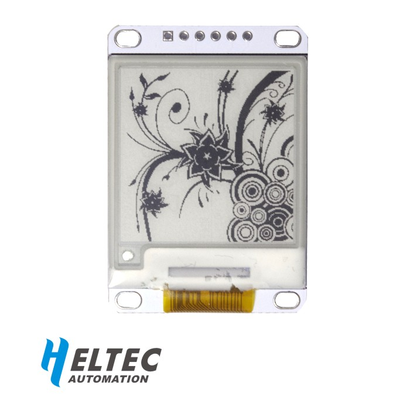
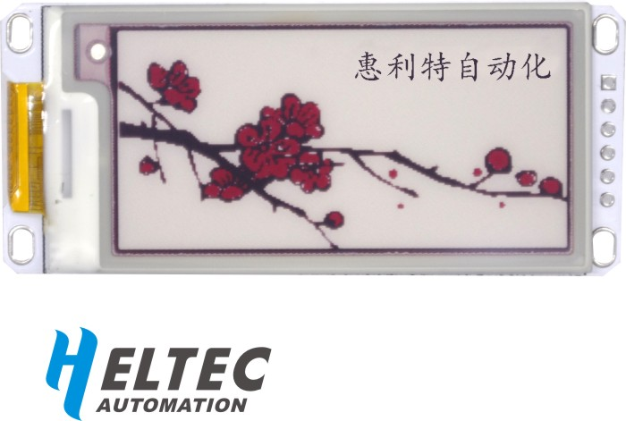
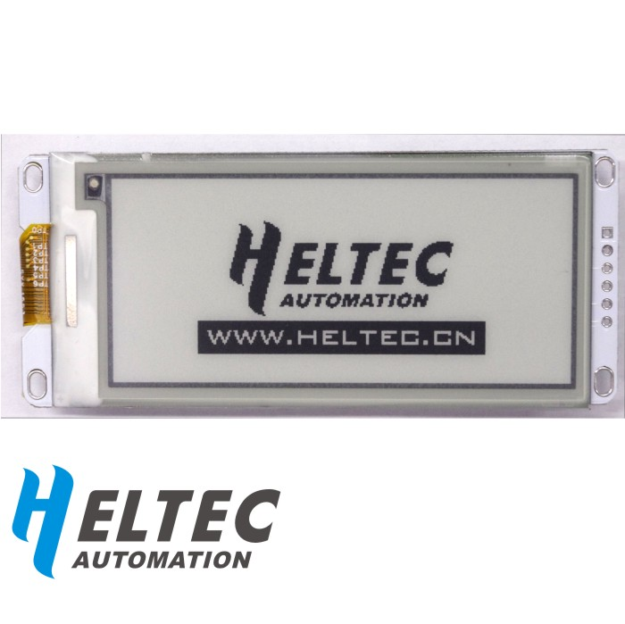

## Contents
- [The Overview](#the-overview)
- [Installing](#installing)
- [Features](#features)
- [Test information](#test-information)
- [Contact us](#contact-us)
# The Overview
--------
- Arduino library for E-Ink display(1.54, 2.3, 2.9) made by HelTec Automation(TM)
- Now this library allows three sizes of e-ink to run on the "AVR" , "ESP32" , "ESP8266" development board.
- **Display size definition in "imagedata.h"**.
# Installing
----------
To install this library:
- Download a zipfile from github using the "Download ZIP" button and install it using the IDE ("Sketch" -> "Include Library" -> "Add .ZIP Library..."
- Clone this git repository into your sketchbook/libraries folder.

For more info, see https://www.arduino.cc/en/Guide/Libraries
# Features
----------
- Arduino library for E-Ink display(1.54, 2.3, 2.9).
- Consumes power only during refresh, power consumption as low as 24-30mW.
- Support for partial refresh, only takes 0.3s.
- Can continue to display for more than half a year in the power-off state.
# Test information
---------

- [e-ink1.54](https://item.taobao.com/item.htm?spm=a1z10.1-c.w14879002-17163498038.8.42ce1d6fDt0Gzk&id=559282775007)
- [e-ink2.13](https://item.taobao.com/item.htm?spm=2013.1.20141001.1.e10141e6UV7eAD&id=559224018532&scm=1007.12144.95220.42296_0&pvid=27ced8e2-6b47-4b4a-a173-0d7e7e992eb3&utparam=%7B%22x_hestia_source%22%3A%2242296%22%2C%22x_object_type%22%3A%22item%22%2C%22x_mt%22%3A0%2C%22x_src%22%3A%2242296%22%2C%22x_pos%22%3A1%2C%22x_pvid%22%3A%2227ced8e2-6b47-4b4a-a173-0d7e7e992eb3%22%2C%22x_object_id%22%3A559224018532%7D)
- [e-ink2.90](https://item.taobao.com/item.htm?spm=2013.1.20141001.2.e10141e6UV7eAD&id=559840859882&scm=1007.12144.95220.42296_0&pvid=27ced8e2-6b47-4b4a-a173-0d7e7e992eb3&utparam=%7B%22x_hestia_source%22%3A%2242296%22%2C%22x_object_type%22%3A%22item%22%2C%22x_mt%22%3A0%2C%22x_src%22%3A%2242296%22%2C%22x_pos%22%3A2%2C%22x_pvid%22%3A%2227ced8e2-6b47-4b4a-a173-0d7e7e992eb3%22%2C%22x_object_id%22%3A559840859882%7D)
# Contact us
- [http://www.heltec.cn/](http://www.heltec.cn/)
- [support mail](mailto:support@heltec.cn)
# Issue/Bug report template
Before reporting an issue, make sure you've searched for similar one that was already created. Also make sure to go through all the issues labelled as [for reference](https://github.com/HelTecAutomation/e-ink/issues).     
